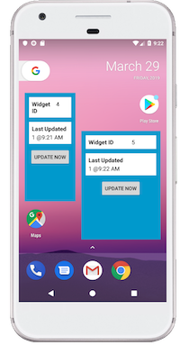

# Android UPC

## Proyectos

### 01 - REST Countries 

Lista los paises de RESTCountries API y CountryFlags.io

### 02 - Sample App 

App vacía explicando las partes en Kotlin

### 03 - Nav Sample 

App en Kotlin Demostrando flujo basico entre fragments

### 04 - NavigationCodeLab

[Tarea de Codelab de Google](https://codelabs.developers.google.com/codelabs/android-navigation/)

### 05 - AppWidgetCodeLab - Java

[Codelab de Google  - App Widgets](https://codelabs.developers.google.com/codelabs/advanced-android-training-widgets/)

### 06 - AppWidgetCodeLab - Kotlin

[Codelab de Google - App Widgets](https://codelabs.developers.google.com/codelabs/advanced-android-training-widgets/)

### 07 - My Address Book - CodeLab

[Codelab de Google - My Address Book](https://codelabs.developers.google.com/codelabs/taking-advantage-of-kotlin/index.html)

### 12 - Android Watch Face - Kotlin

https://codelabs.developers.google.com/codelabs/watchface-kotlin/#0

### 13 - Wear OS Navigation and Actions with Wear 2.0 - Kotlin

[Codelab de Google - Nav Actions}(https://codelabs.developers.google.com/codelabs/wear-nav-action/index.html)

## Colaboradores

- Gonzalo Cirilo - [GitHub](https://github.com/GonzaloCirilo)

